<h2>Лабораторная работа №1</h2>

1. Добавлена и реализована функция

```
void generate_test_images(const std::string& im_path, FileFormats ff, const int scale = 5)
```

которая растягивает и сжимает данное изображение в n раз и добавляет путь до него в task01.lst файл, за счёт чего удобно формировать тестовую выборку картинок. В качестве основы я использовал три изображения форматов .tiff, .png и .jpg

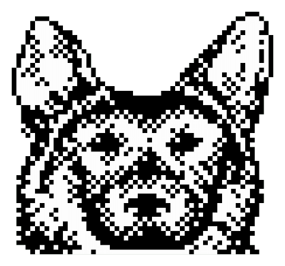

2. Реализованы функции

```
std::string strid_from_mat(const cv::Mat& img, const int n = 4)
```

```
std::vector<std::filesystem::path> get_list_of_file_paths(const std::filesystem::path& path_lst)
```

Замечу, что мой компилятор не поддерживает CV_32U, а потому обработка типа uint32 не добавлена. Никакого аномального поведения этих функций не обнаружено.

3. Функция гамма-коррекции одноканального 8-битного изображения

```
void gamma_correction(const cv::Mat &src, cv::Mat &dst, const float gamma)
```

реализована с помощью Lookup table, это эффективнее для изображений с маленькой глубиной чем обычный перебор. Формула для гамма-коррекции
	
```
V_{out} = V_{in} ** {1./γ}
```

сначала применяется к каждому из 256 возможных пикселей, а затем уже cv::LUT изменяет пиксели в исходном изображении. Чем больше γ, тем светлее картинка:

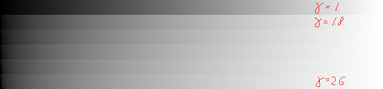

<h2>Лабораторная работа №2</h2>

1. Добавлены и реализованы функции

```
cv::Mat gen_tgtimg00(const int lev0, const int lev1, const int lev2)
```

```
cv::Mat add_noise_gau(const cv::Mat& img, const int std)
```

```
cv::Mat add_noise_salt(const cv::Mat& img, const int pa, const int pb)
```

```
cv::Mat calcHistNaive(const cv::Mat& src);
```

```
cv::Mat calcHistLib(const cv::Mat& src);
```

```
cv::Mat drawHist(const cv::Mat& counter, const int height = 256, const int bold = 1);
```

Рассмотрим более подробно как вычисляется и рисуется гистограмма:

* Функция ```calcHistNaive``` просто перебирает все пиксели ```src``` матрицы, передавая массив ```counter``` длины 256 (каждый элемент которого представляет количество пикселей определённого цвета) в ```drawHist```

* А затем функция ```drawHist``` формирует изображение гистограммы, отрисовывая для каждого цвета прямоугольник с высотой, равной его значению, и шириной ```bold```. А затем подписывает гистограмму, обозначая общее количество пикселей (```src.cols``` x ```src.rows```) и глубину исходного изображения.

* Функция ```calcHistLib``` вместо двойного цикла использует функцию из библиотеки ```opencv``` ```calcHist``` (однако затем массиву с подсчитанными пикселями будет требоваться нормализация)

2. Для демонстрации работы двух разных функций зашумления мы будем использовать фотокарточку Лены; её гистограмма представлена ниже:

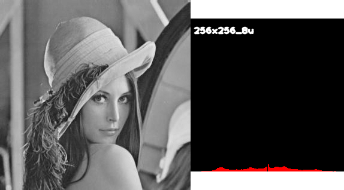

Функция ```add_noise_salt``` реализует **Salt&Pepper Noise**. Она принимает нижний и верхний пороги зашумлённых пикселей, а затем случайно генерирует их число и позиции. Salt означает количество белых, а Pepper - чёрных пикселей. Это самый простой из возможных шумов, так что результат его работы выглядит не очень впечатляюще:

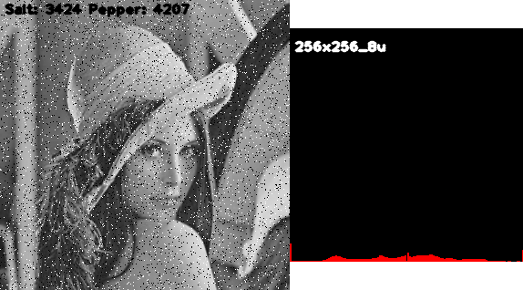

В гистограмме зашумлённого изображения самыми высокими оказываются столбики белого и чёрного цвета, прочие немного понизились - такой результат следует напрямую из реализации.

3. Функция ```add_noise_gau``` реализует **Gauss Noise**. С помощью ```cv::randn``` она генерирует матрицу с нормально распределёнными случайными числами. Их матожидание, ```mean```, мы берём нулевым, чтобы среднее значение зашумлённого изображения не отличалось от исходного. С ненулевой медианой основные цветовые столбцы гистограммы будут сдвинуты, а распределения будут больше похожи на нормальные:

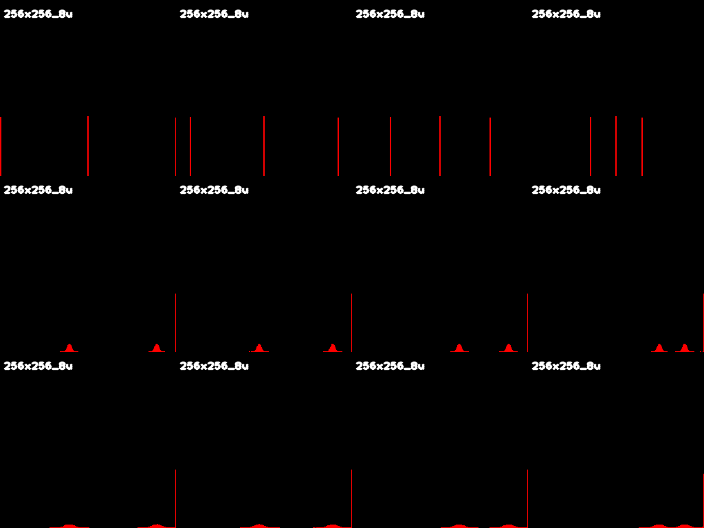

В ```cv::randn``` среднеквадратичное отклонение ```std``` даёт нам отклонение от матожидания. Чем больше будет ```std``` (берутся более нижние строчки), тем сильнее столбики будут "расползаться", так как вероятность появления новых цветов будет выше.

В итоге попиксельно складываем случайную матрицу и наше изображение (первая должна иметь тип ```CV_16SC1```; если взять ```unsigned char```, то распределение не будет нормальным, так как не будет значений слева от матожидания). Получаем зашумлённую картинку:

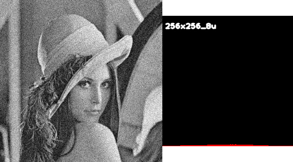

Гистограмма зашумлённого изображения напоминает нормальную кривую (мы взяли ```std=20```)

4. Расчёт статистик случайных гауссовых масок с помощью python скрипта: использовались статистический тест Шапиро (библиотека scipy) и рисование QQ-графиков (библиотека matplotlib). Один из QQ-графиков (```mean = 127```, ```std = 11, 31```) показывает, что случайные числа в матрице и правда распределены нормально (мало отклоняются от диагонали):

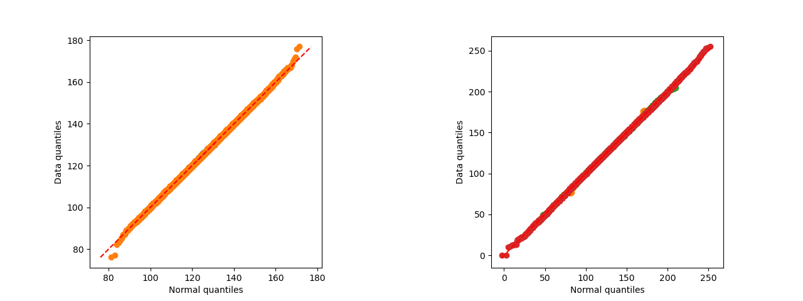

Кроме того, можно посмотреть на гистограммы (для тех же двух случайных масок) и увидеть, что они очень похожи на нормальную кривую **bell-shaped**:

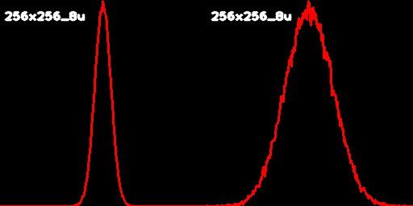

Таблица с отклонениями матожидания и среднеквадратичного отклонения от теоретических параметров:

| MEAN | STD |
| ---- | --- |
| 0.00112915039062 | 0.041584671240483 |
| 0.04339599609375 | 0.01689416848298 |
| 0.03549194300000 | 0.095582763889897 |
| 0.05899047851562 | 0.093146866895527 |
| 0.26417541500000 | 0.8368595594616 |

5. Консольное приложение task02.exe генерирует коллаж тестовых изображений с разными яркостями:

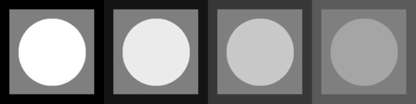

Затем с помощью гауссова шума зашумляет его с разными std, равными 3, 7, 15:

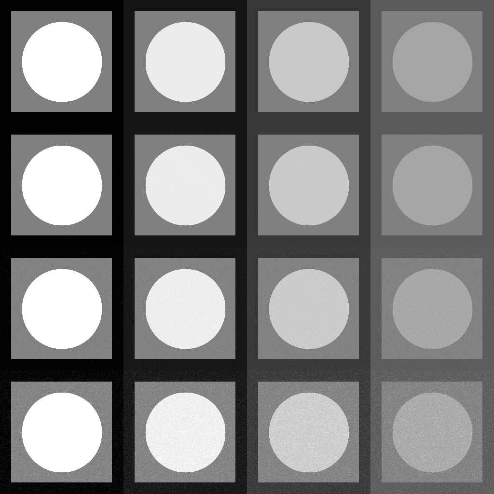

На коллаже из гистограмм для каждой картинки хорошо видно, что вначале у нас было всего три цвета (первая строчка), причём яркость для каждого следующего изображения становилась менее контрастной (сдвигалась к центру, то есть к серому); поскольку ```mean=0```, то столбики никуда не сдвигаются по вертикали (большинство пикселей сохраняют свой цвет, так как к ним скорее всего будет прибавлено 0 интенсивности); поскольку ```std``` растёт, то появляются новые столбики (разброс доп. интенсивности становится больше)

Столбики, соответствующие белому и чёрному цветам, на изображениях в первом столбце довольно высокие, поскольку ```uchar``` ограничен значениями 0 и 255: если мы выходим за пределелы, то пиксели из "хвостов" этих кривых становятся белыми/чёрными.

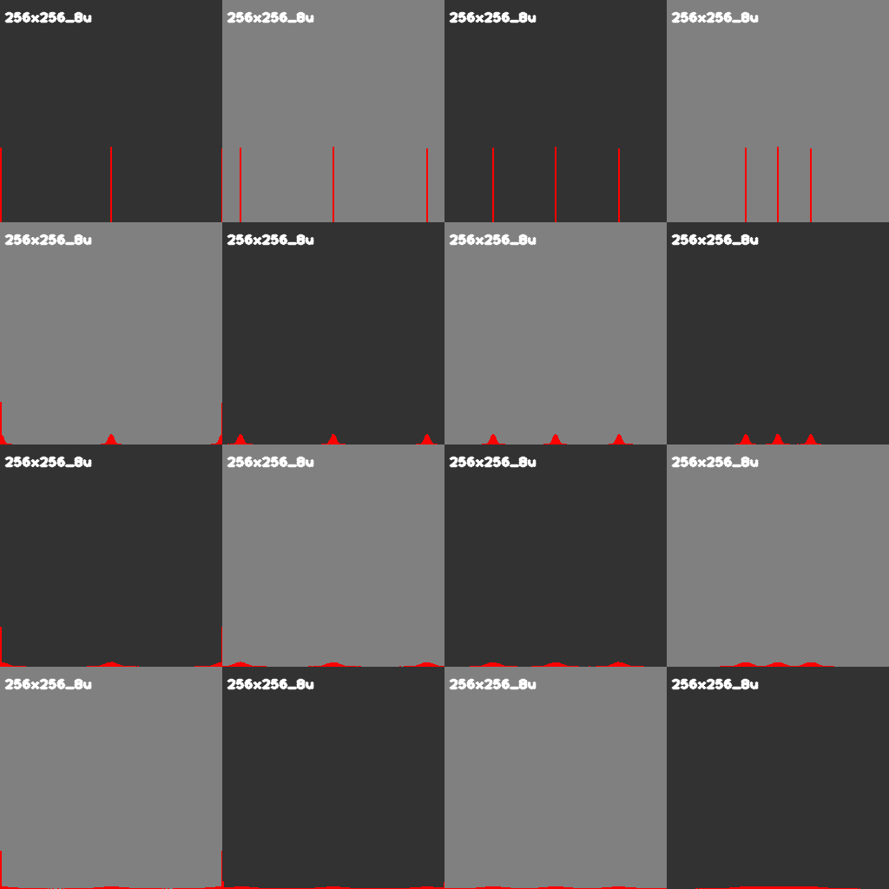<h2>Лабораторная работа №3</h2>

1. Добавлена функция

```
cv::Mat autocontrast(const cv::Mat& img, const double q_black, const double q_white)
```

которая возвращает более контрастное изображение. Серьёзность контраста зависит от белого и чёрного квантилей (числа от 0 до 1), которые говорят нам, какую долю пикселей преобразовывать в белый или чёрный цвета. Принцип работы таков:

* На основе гистограммы формируем функция распределения яркости ```CDF(x) = Prob{X <= x}```, вероятность считается как частное числа пикселей i-й интенсивности к их общему количеству.
* Вычисляем пороги белого и чёрного ```wT``` и ```bT```: если интенсивность пикселя будет меньше ```bT```, то он считается чёрным, если она больше ```wT```, то он считается белым.
* Наконец, проходимся двойным циклом по всем пикселям. Здесь я выделил два метода преобразования интенсивности: **Naive** (просто сравнивать) и **Linear** (линейно изменять). Рассмотрим их более подробно.

2. Naive метод. Сравнение выглядит примерно так:

```
if (pixel <= bT) {
	res.at<uchar>(i, j) = 0;
}
else if (pixel >= wT) {
	res.at<uchar>(i, j) = 255;
}
```

Результат применения (берутся небольшие квантили, 1% и 0.5% для чёрного и белого цветов):

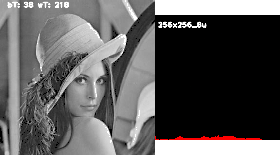

На перьях шляпки и на плече хорошо видно, что мы получаем точечное контрастирование. Разумеется, гистограмма выглядит как столбики белого / чёрного / интенсивностей, вошедших в интервал ```(bT, wT)```, остальные оказываются нулевыми. Чтобы убрать такую "поточечность", будем изменять интенсивность линейно.

3. Linear метод. Выведена следующая формула:

```
max(0, min(255, 255 / | wT - bT | * (pixel - bT) ) )
```

Несложно убедиться, что есть интенсивность ```pixel < bT``` или ```pixel > wT```, то он становится чёрным или белым соответственно. Однако чем она ближе к порогу, тем сильнее меняется: за счёт этой функциональной зависимости мы получаем, во-первых, более гладкий и, во-вторых, охватывающий почти все области, контраст:

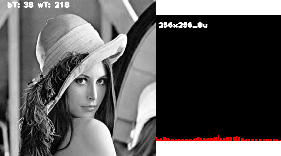

Гистограмма стала более разреженной (соседние интенсивности склеиваются в одну), а числа пикселей каждой интенсивности выровнялись - последствия линейности преобразования.

4. Проверка: если задать квантили ```black_q = white_q = 0.5```, то мы сделаем изображение чёрно-белым:

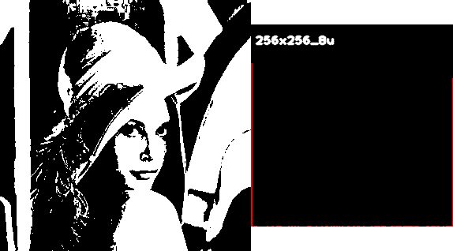

Порогами чёрного и белого будут средние интенсивности 128 и 129: так что чуть более тёмные места станут чёрными, а чуть более светлые - белыми. Что может быть ещё контрастнее?

5. Результат применения на двух типах картинок (было/стало):

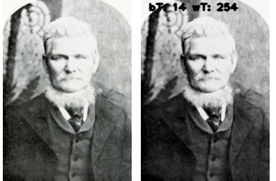

6. Добавлена функция наивного контрастирования

```
cv::Mat autocontrast_naive(const cv::Mat& img, const double q_black, const double q_white)
```

Когда ей подают на вход трёхканальное RGB изображение, она применяет ```autocontrast()``` по каждому каналу. Протестируем её работу (было/стало):


Из последнего изображения видно, что наивное контрастирование работает довольно плохо.

Гистограммы: наивный, ненаивный контрасты (все каналы учитываются, так как переводим в HSV и смотрим на канал интенсивности, для каждого пикселя меняем значение и записываем его в loopback table, которую потом применяем к данному каналу) и контраст с использованием алгоритма AGCIE (умная гамма-коррекция по каналу интенсивности в HSV формате, опять же):

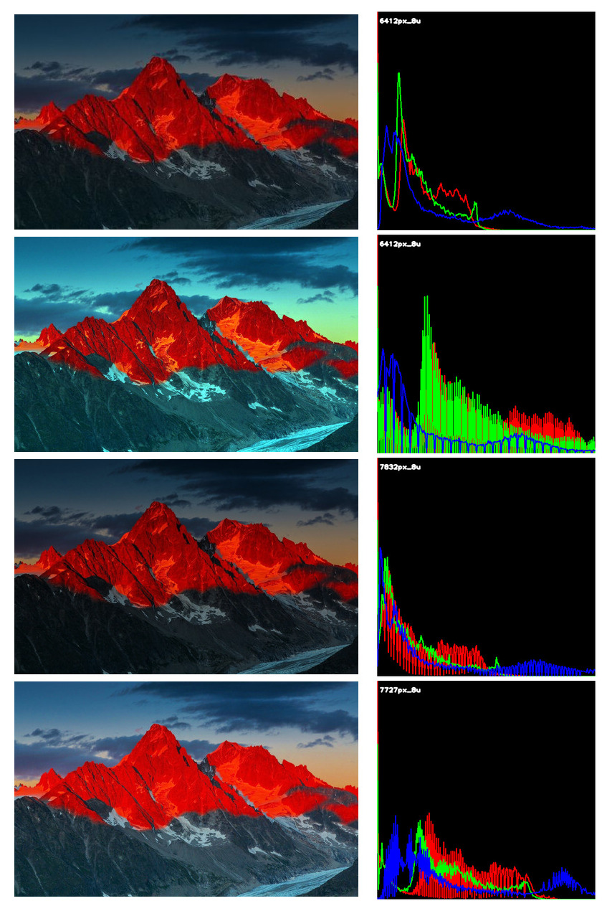
<h2>Лабораторная работа №4</h2>

1. Соглашение о форматах: https://github.com/emilakper/for-wiki-share/wiki

2. Около 53% средняя точность. Всё из-за гауссова шума (если его серьёзно обрабатывать, то границы размываются и эллипсы "толстеют"):

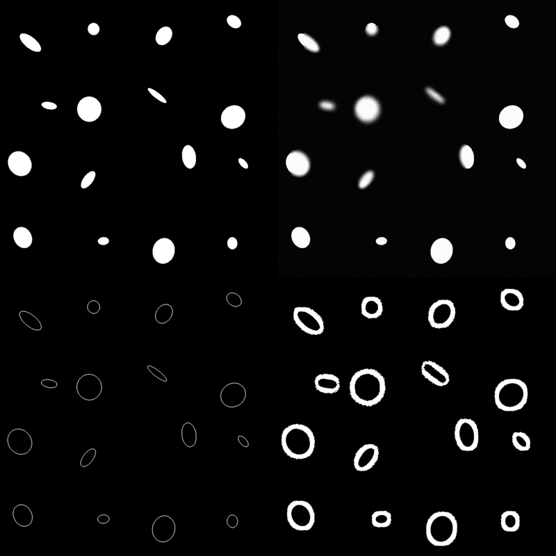

3. Если использовать более продвинутый метод (алгоритм Кэнни + оператор Собеля, например), то результаты гораздо лучше:

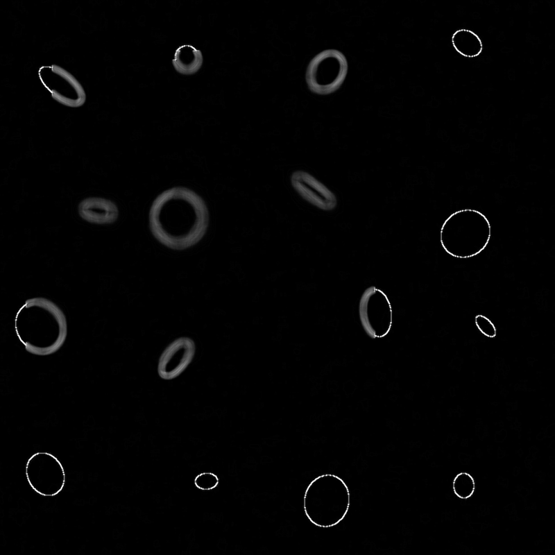
<h2>Контрольная работа №1</h2>

1. Функция ```gen_tgtimg01()``` генерит картинку I₀: кружок r = 40 в квадрате a = 127

2. Цвета: все упорядоченные пары из множества {0, 127, 225}. Два ядра свёртки w₁ и w₂

3. I₁ = I₀ * w₁; I₂ = I₀ * w₂; I₃ = √(I₁² + I₀²); I₄ = rgb(I₁,I₂,I₃) - в конце лепим коллаж из них

4. Составленные изображения:

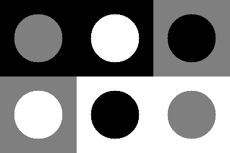

5. Для первой картинки:

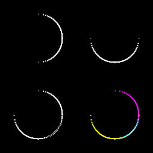

5. Для второй картинки:

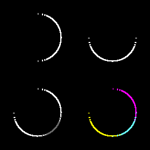

5. Для третьей картинки:

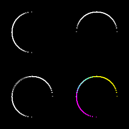

5. Для четвёртой картинки:


5. Для пятой картинки:

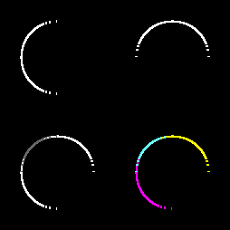

5. Для шестой картинки:


<h2>Лабораторная работа №6</h2>

1. Соглашение о форматах: https://github.com/emilakper/for-wiki-share/wiki

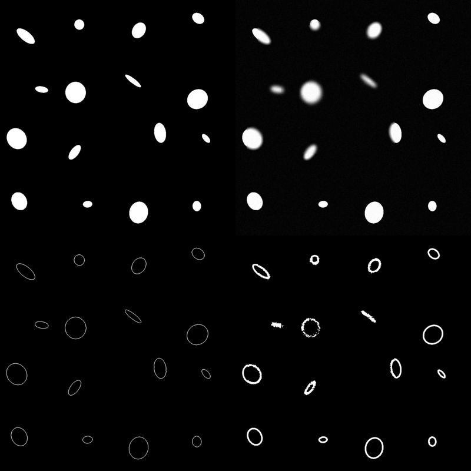
